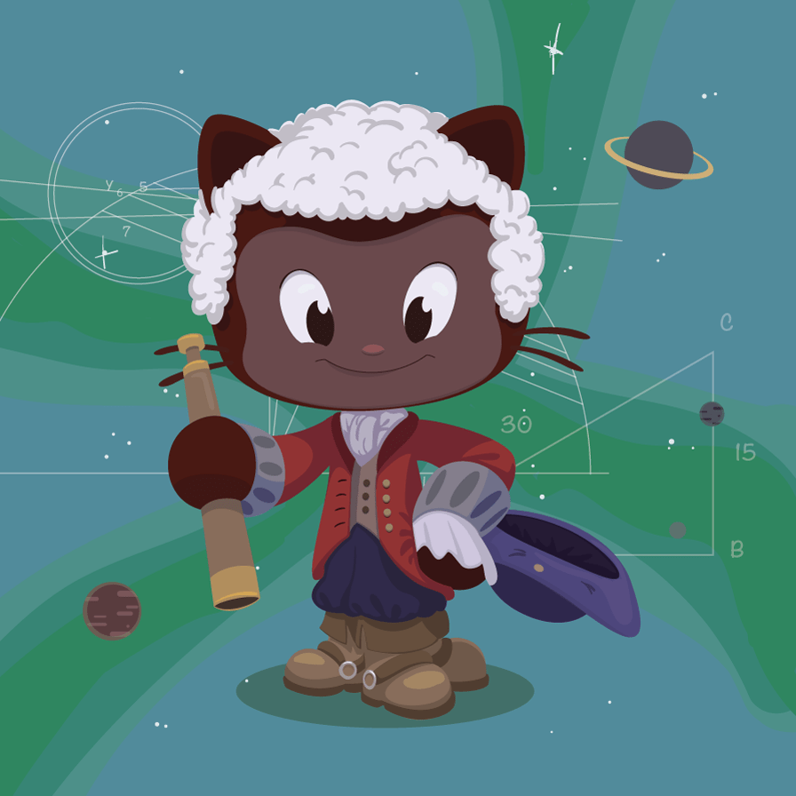

# language {#custom-id}
English Learning App

<!--  -->

## More examples on Mermaid

***

## Advanced title here
==Highlighted Text==  
~~Struck Text~~

| col1 | col2 | co3 |
|-|-|-|
| 1 | john | male |
| 2 | mike | male |
| 3 | vanessa | female |

- [x] task1
- [ ] task2
- [x] task3
- [x] task4

Here[^1] is a statement.[^2]
Here[^3] is a statement.[^4]

[^1]: This is the footnote.
[^2]: This is this another footnote.
[^3]: This is this another footnote.
[^4]: This is this another footnote.

**Term**  
Definition of the term

**Another Term**  
The definition for the other term

some [id](#language-custom-id)
head to advanced [id](#advanced-title-here)

:emoji:  
:rocket:  
:smile:  
:sleeping:  

## Code

I strongly recommend against using any `<blink>` tags.

I wish SmartyPants used named entities like `like` `&mdash;`
instead of decimal-encoded entities like `&#8212;`.

    this is a 
    a piece of 
    coding

&copy;
k
***
un\*frigging\*believable

1986\. What a great season.

## All about lists

adfbc  
def  
[igh](www.example.com)

1. Crack three eggs over a bowl.

    Now, you're going to want to crack the eggs in such a way that you don't make a mess.

    If you _do_ make a mess, use a towel to clean it up!

2. Pour a gallon of milk into the bowl.

    Basically, take the same guidance as above: don't be messy, but if you are, clean it up!

3. Rub the salmon vigorously with butter.

    By "vigorous," we mean a strictly vertical motion. Julia Child once quipped:
    > Up and down and all around, that's how butter on salmon goes.
4. Drop the salmon into the egg-milk bowl.

    Here are some techniques on salmon-dropping:

    * Make sure no trout or children are present
    * Use both hands
    * Always have a towel nearby in case of messes* group a

* group a
    * item a1
    * item a1
    * item a1
* group b
    * item b1
    * item b1
    * item b1
        * item b11
    * item b1
    * item b1
    * item b1

| Mechanic     | Description     |
|--------------|----------------|
| Resource     | Collect items  |
| Puzzle       | Solve riddles  |

>this was just a paragraph
>
> then it became more than that
but it continues ofcourses
>
> # hello sir
>
>lorem afasd fas fadf a dfa slorem afasd fas fadf a dfa slorem afasd fas fadf a dfa slorem afasd fas fadf a dfa slorem afasd fas fadf a dfa slorem afasd fas fadf a dfa slorem afasd fas fadf a dfa slorem afasd fas fadf a dfa slorem afasd fas fadf a dfa slorem afasd fas fadf a dfa slorem afasd fas fadf a dfa slorem afasd fas fadf a dfa sfffffffffffflorem afasd fas fadf a dfa sf

**sir**

[*] - okay
[ ] - okay
[ ] - _okay_

